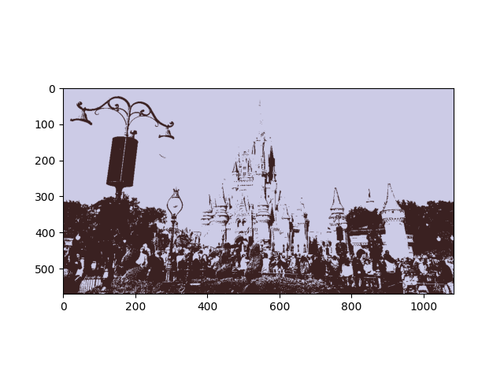
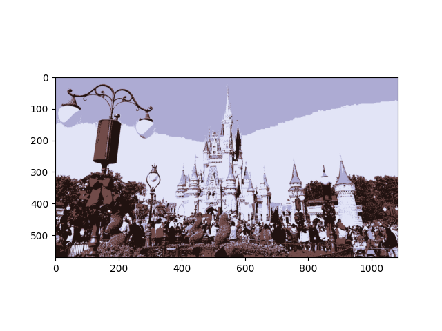
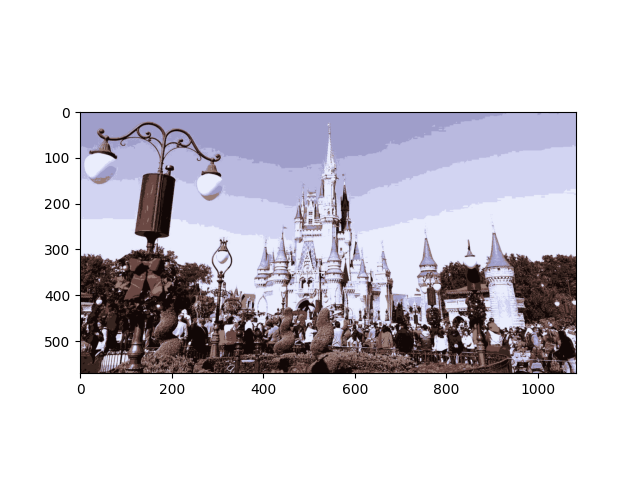
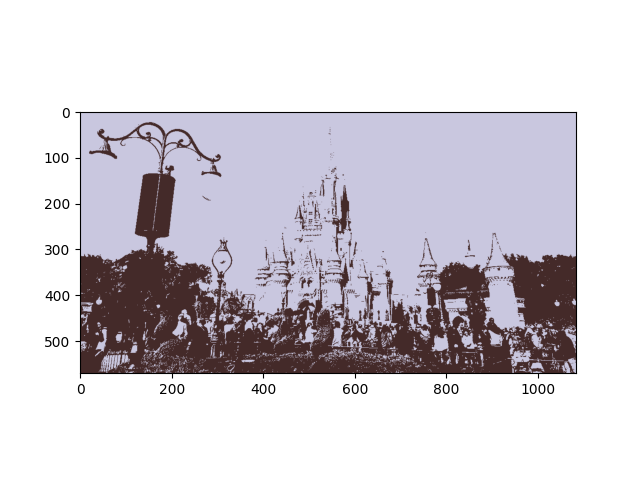
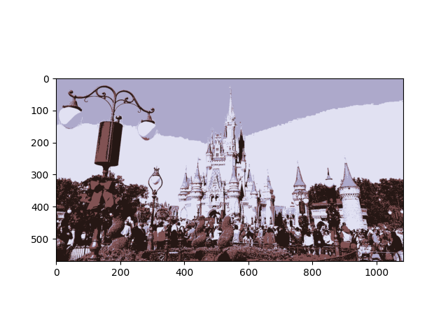
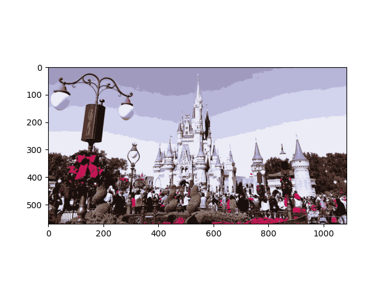

# Image K-Means Compressor


## Table of Contents
- [Description](#description)
- [Usage](#usage)
- [Output](#output)
- [Example](#example)

## Description
This project implements the K-means clustering algorithm to compress images. The implementation is done without using any external libraries for K-means clustering.


## Usage
To compress an image, first create an instance of `ImageCompressor` class. You can then read the image using the `read_bmp` method. After reading the image, you can call `kmeans_compress` method to compress the image.
```python
from ImageCompressor import ImageCompressor
compressor = ImageCompressor()
compressor.read_bmp("input_image.bmp", "input_image_3D.png")
compressor.kmeans_compress(k=16, norm=2, img_path="compressed_image.png")
```

You can adjust the compression level by changing the `k` parameter. A higher value of `k` will result in better quality but larger file size. The `norm` parameter determines the normalization method used in the K-means algorithm.

## Output
The output of the `kmeans_compress` method is the compressed image. It is saved as a PNG file specified in the img_path parameter.


## Example

Shape of the matrix: (570, 1084, 3)
Compress from (570, 1084, 3) array into (617880, 3)
Number of data: 617880 With dimensions = 3

### K = 2 ; Norm = 1
iteration 5 ; Cumulative Time = 0.2798728942871094
Total distance: 32799200.996086888
Finished compressing! Please see wdw_l1k2.png


### K = 4 ; Norm = 1
iteration 9 ; Cumulative Time = 0.7677738666534424
Total distance: 19493470.104083724
Finished compressing! Please see wdw_l1k4.png


### K = 6 ; Norm = 1
iteration 14 ; Cumulative Time = 1.5598139762878418
Total distance: 15489158.096972229
Finished compressing! Please see wdw_l1k6.png


### K = 8 ; Norm = 1
iteration 24 ; Cumulative Time = 3.399869203567505
Total distance: 13364360.912264002
Finished compressing! Please see wdw_l1k8.png


### K = 2 ; Norm = 2
iteration 10 ; Cumulative Time = 0.4967329502105713
Total distance: 33299212.95240306
Finished compressing! Please see wdw_l2k2.png


### K = 4 ; Norm = 2
iteration 37 ; Cumulative Time = 2.900310754776001
Total distance: 19880701.144455835
Finished compressing! Please see wdw_l2k4.png


### K = 6 ; Norm = 2
iteration 53 ; Cumulative Time = 5.878566026687622
Total distance: 16944748.781927068
Finished compressing! Please see wdw_l2k6.png


### K = 8 ; Norm = 2
iteration 151 ; Cumulative Time = 21.121123790740967
Iteration exceed max iteration.
Total distance: 13860580.769553838
Finished compressing! Please see wdw_l2k8.png


